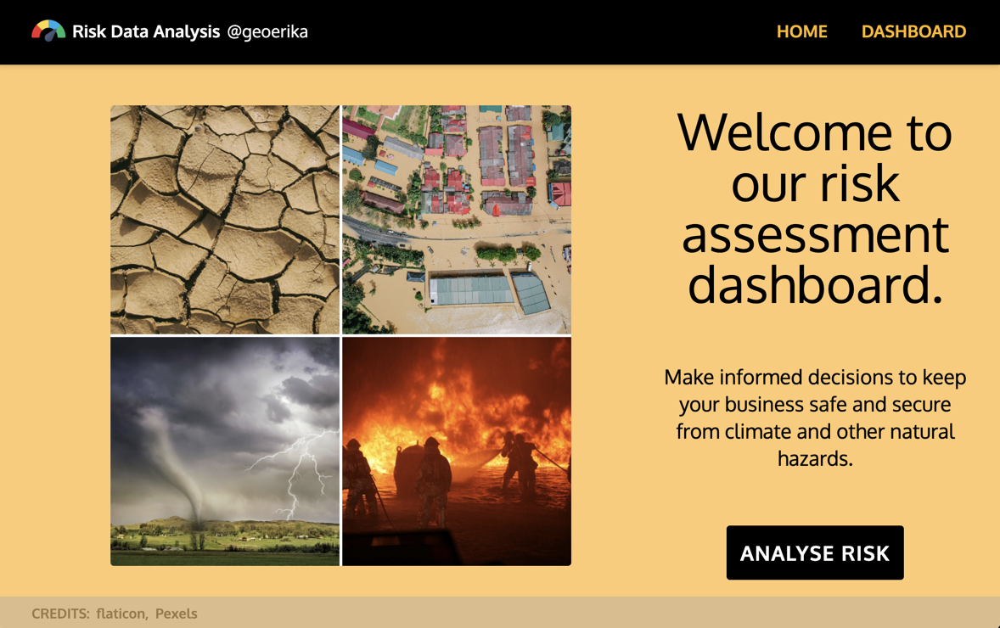
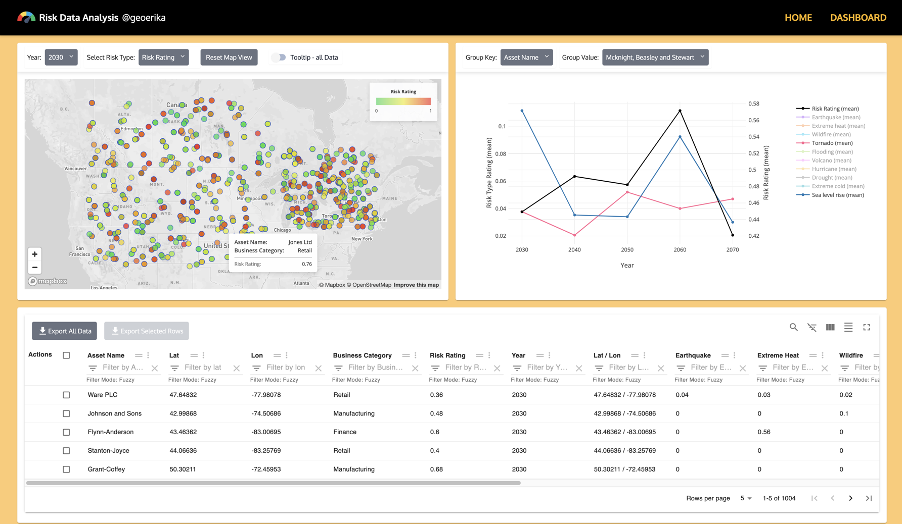
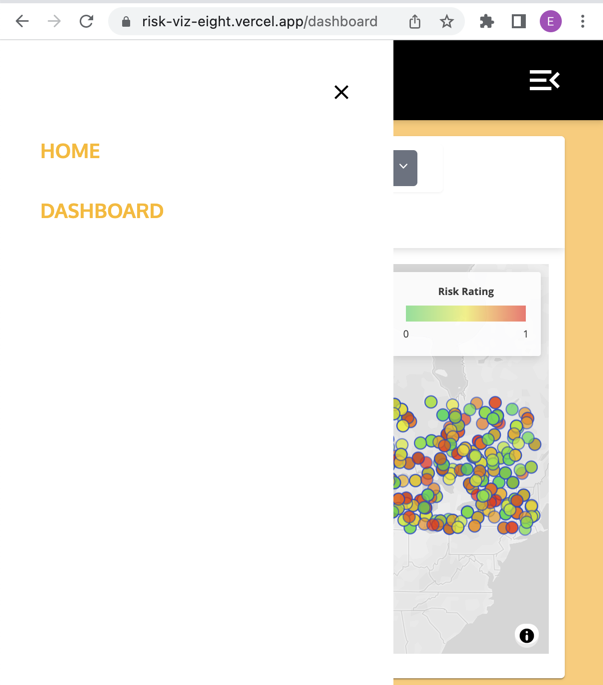

## RISK DATA ANALYSIS

### [LIVE LINK](https://risk-viz-eight.vercel.app/)
### [REPOSITORY](https://github.com/altgeoerika/risk-viz)

[ChatGPT Logs](https://docs.google.com/document/d/1BdEhYGOxmEGQqxYrtn0LRW316ILvcauuntM9NgOTWn0/edit?usp=sharing)

A simple application displaying data in Map, Line Chart & Table. Implemented with React, JavaScript, Node.js, Next.js, Tailwindcss, Deck.gl, Plotly.js, MUI, Material React Table, Headless UI, Danfo.js, AWS, csvtojson.

## Dashboard
- The dashboard was designed using the [MUI](https://mui.com/) grid system, which is fully responsive

### Data
- During the initial stages of this project, I noticed that the data contained only a few distinct location points. This was discussed with Leo Li which encourged changes in the data set for a better distribution & desity of points displayed on the map. Therefore, I generated a 500 set of random unique coordinates distributed over US & Canada.
- This enriched set of coordinates were then uploaded in a personal aws s3 bucket
- The data is fetched directly by the application from the s3 bucket during an api call &, through the csvtojson package, transformed into json format
- Quering & filtering of data is done using both custom `Typescript` functions & `Danfo.js` library

### Map

- The map was created in a forked repo of an open-source project that I contributed to in the past, [react-maps](https://github.com/geoerika/react-maps/tree/scatterplot). It is based on the [Deck.gl](https://deck.gl/) library and uses color fill based on data values applied in a `Scatterplot` layer
- The following actions were implemented for the map:
  - selection of Year
  - selection of metric (various Risk Rating types) to display on the map
  - a button which resets map view to data extent on the map
  - a switch which can be used to read all data values for various risk data for a particular location, as well as its coordinates (`lat, lon`)
  - zooming into a location coordinates upon clicking / selecting a location on the map
  - general zoom buttons
  - selecting a location on the map will change the data plotted in the `Line Chart` to showcase the variation of the location risks over the `2030-2070` time interval

### Line Chart

- The `Line Chart` was implemented using the [Plotly.js](https://plotly.com/javascript/multiple-axes/) library
- The chart supports the following interactions:
  - selecting an data aggregation string key used to aggregate data by
  - selecting a string value for the aggregation key to display the trend of various risk data over the `2030-2070` time interval
  - the chart will showcase first just the trend for the total Risk Rating values - right side  y-axis
  - using the Legend, the user can then toggle on various other risk types to compare with the total risk trend; these values can be observed on the left side y-axis
  - selecting a set of coordinates in the chart will trigger the map to zoom into the selected location
  - by hovering over the points on the chart lines, the user can read the Year, Risk type, aggregation key & value values

### Data Table
- The table used in this application is based on the [Material React Table](https://www.material-react-table.com/)
- Feature highlights:
  - global search
  - individual filters for string & column values
  - sorting
  - row selection
  - 2 types of csv exports: all data & selected rows

  ### Navbar
  - The application has 2 pages, `Home` & a `Dashboard` which can be viewd by using the buttons in the Navbar on top
  - The `Navigation` bar is fully responsive & presents a hamburger menu for mobile screens

  ### Other considerations
  - The application is based on `Nexj.js` framework and makes use of both `SSR` & `CSR`
  - The client side components are loaded using `Next.js`' dynamic lazy loading

  ### Unit Tests
  - Due to time constraints, only a limited number of unit tests were implemented with `Jest`









This is a [Next.js](https://nextjs.org/) project bootstrapped with [`create-next-app`](https://github.com/vercel/next.js/tree/canary/packages/create-next-app).

## Getting Started

First, run the development server:

```bash
npm run dev
# or
yarn dev
# or
pnpm dev
```

Open [http://localhost:3000](http://localhost:3000) with your browser to see the result.

You can start editing the page by modifying `app/page.tsx`. The page auto-updates as you edit the file.

[http://localhost:3000/api/hello](http://localhost:3000/api/hello) is an endpoint that uses [Route Handlers](https://beta.nextjs.org/docs/routing/route-handlers). This endpoint can be edited in `app/api/hello/route.ts`.

This project uses [`next/font`](https://nextjs.org/docs/basic-features/font-optimization) to automatically optimize and load Inter, a custom Google Font.

## Learn More

To learn more about Next.js, take a look at the following resources:

- [Next.js Documentation](https://nextjs.org/docs) - learn about Next.js features and API.
- [Learn Next.js](https://nextjs.org/learn) - an interactive Next.js tutorial.

You can check out [the Next.js GitHub repository](https://github.com/vercel/next.js/) - your feedback and contributions are welcome!

## Deploy on Vercel

The easiest way to deploy your Next.js app is to use the [Vercel Platform](https://vercel.com/new?utm_medium=default-template&filter=next.js&utm_source=create-next-app&utm_campaign=create-next-app-readme) from the creators of Next.js.

Check out our [Next.js deployment documentation](https://nextjs.org/docs/deployment) for more details.
